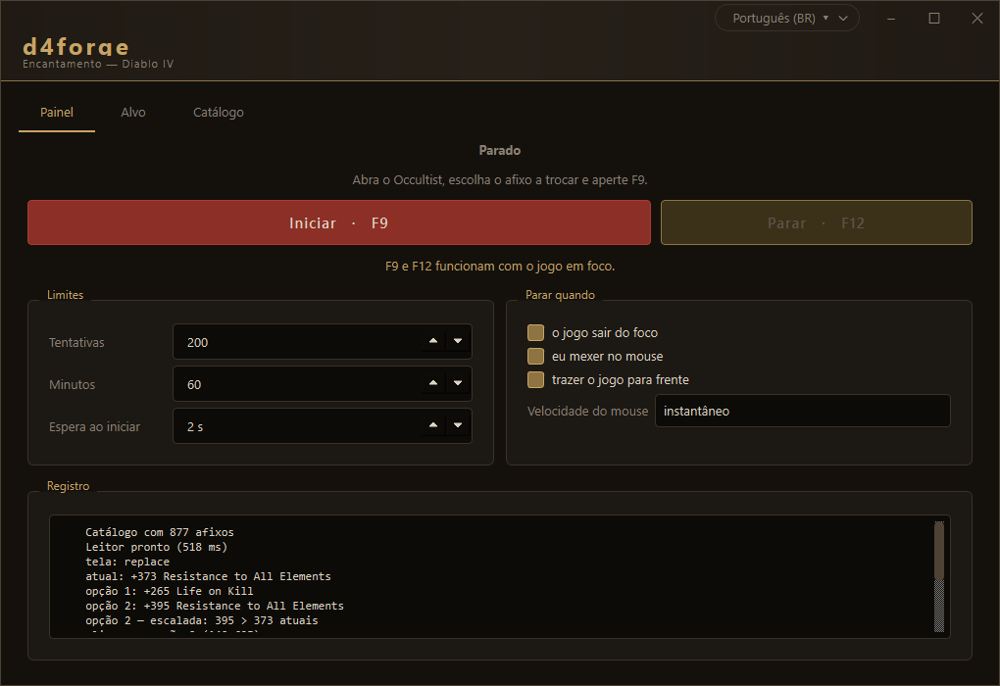

# d4forge

[Português](README.md) · **English**

Enchanting assistant for Diablo IV. It automates the Occultist loop: press
Enchant, accept, **read both options on screen**, decide by your rules, and
repeat until the affix you want shows up.

<p align="center">
  
</p>

---

## Install

Download the `.zip` from the [latest release](../../releases/latest), extract it
and run `d4forge.exe`. No Python needed.

<details>
<summary>Running from source</summary>

Needs **Python 3.13** — 3.14 has no wheel for `onnxruntime` or `PySide6` yet.

```powershell
py -3.13 -m venv .venv
.venv\Scripts\python.exe -m pip install -r requirements.txt
.venv\Scripts\python.exe run.py
```

To build the executable and the shortcut:

```powershell
.venv\Scripts\python.exe tools\build_exe.py
.venv\Scripts\python.exe tools\criar_atalho.py
```

</details>

### Your antivirus will complain

It will, and it is a false positive. On
[VirusTotal](https://www.virustotal.com/gui/file/dff736ae7f4e783990bf781401047c2764a1dc64fe967ffe9c5cf470fa45328f),
4 out of 71 engines flag the executable — and **all four are heuristic or machine
learning**, not one is a signature:

| engine | detection | what it means |
|---|---|---|
| Microsoft | `Trojan:Win32/Wacatac.B!ml` | the **`!ml`** suffix is "machine learning"; it is Microsoft's catch-all bucket |
| SentinelOne | `Static AI - Suspicious PE` | says "static AI" in the name itself |
| Arctic Wolf | `Unsafe` | generic, no family named |
| SecureAge | `Malicious` | generic, no family named |

The other 67 engines — Kaspersky, BitDefender, ESET, Avast, Sophos and the rest —
flag nothing. Real malware does not slip past all of them.

**Why it triggers.** Three things stacked:

1. The binary is **not signed**. A signing certificate costs money per year, and
   this project is free.
2. PyInstaller appends the whole Python runtime as an *overlay* at the end of the
   file — the same shape a packer uses. That is the `overlay` tag VirusTotal
   shows.
3. The app honestly does **the same things a trojan does**: it injects synthetic
   input, captures the screen, enumerates another process's windows and raises
   its own priority. Describing an automation bot and describing a RAT produces
   nearly the same list.

The third one has no fix: that is the program working. An enchanting assistant
that neither clicked nor read the screen would be useless.

**What you can do**, in order of confidence:

- **Run from source** (just above). Then there is no binary for the antivirus to
  judge, and you read exactly what you are about to execute.
- **Check the hash** of your download against the one published in the release.
- **Read the code.** All of it is public and the license is GPL-3.0.

If you want to help fix it at the source, [docs/falso-positivo.md](docs/falso-positivo.md)
has the four vendors' forms and the text to send.

## Usage

1. **Target** — pick the affix, the condition and the value. Search matches
   anywhere in the name: typing `resist` finds `Fire Resistance` and
   `Resistance to All Elements`.
2. Open the Occultist in game and **select the affix you want to reroll**.
3. Press **F9**.

**F9** starts and stops; **F12** only stops. Both work while the game has focus.

On start the app **brings Diablo IV to the front by itself** and confirms it
worked — then the cycle begins in 0.4 s. The configurable delay is only spent
when Windows refuses focus, which is exactly when you need the Alt+Tab.

The loop also stops if the game loses focus, if you move the mouse, or when the
attempt and time limits are reached.

### Climbing

On by default. While the item lacks the target affix, the bot takes it at **any
value**; after that it only swaps for a **strictly higher** one, up to the goal:

```
x22% Shadow Damage Multiplier   (current item)
20% Poison Damage Multiplier    → take
21% Poison Damage Multiplier    → take  (21 > 20)
20% Poison Damage Multiplier    → no    (never downgrades)
25% Poison Damage Multiplier    → take and finish  (goal >= 24)
```

Every attempt costs the same whether you pick something or not, so grabbing the
right affix early is never more expensive.

> Use **`>=`**, not `=`. With `=`, a roll of 405 against a goal of 400 makes the
> climb overshoot the target and never finish.

---

## How it works

```
Enchant → [Accept] → [read both options] → Replace Affix → Close → repeat
```

`Accept` is bracketed because **the confirmation dialog does not always show
up**. That is why the engine is not a fixed sequence: each pass it looks at
which screen the game *is* on and picks the matching action.

`No Change` comes pre-selected on the Replace Affix screen. That is what makes
"pick nothing" the safe action — and it is what the app does whenever it is not
sure.

| module | role |
|---|---|
| `window.py` | finds the game window |
| `capture.py` | capture via dxcam, falling back to mss |
| `profile.py` | ROIs measured at 1920x1080, scaled to the real resolution |
| `vision/states.py` | tells which of the 5 screens the game is on |
| `vision/ocr.py` | reads the text lines |
| `affixes.py` | catalog, line grammar and misread correction |
| `rules.py` | your acceptance criteria and the final decision |
| `automation/` | SendInput and the safety guards |
| `engine.py` | the dispatcher |

### Measured numbers

| step | cost |
|---|---|
| capturing one ROI | ~0.1 ms |
| detecting the screen state | ~2 ms |
| OCR of a line (cached / new) | ~1 ms / ~70 ms |
| the game's own reaction to a click | ~80 ms |
| **one full loop** | **~1.5 s** |

---

## What building it taught

Almost everything here came from measuring against real game captures, not from
intuition.

### The detector was inflating the image 7×

The biggest optimization in the project, and it had nothing to do with our code.
RapidOCR ships with `limit_type: min` and `limit_side_len: 736`: it resizes
until the **shorter** side reaches 736. An affix line is wide and short
(660×104), so this multiplied everything by 7 and fed **4670×736 — 3.4
megapixels — to read a single line of text**.

| setting | ms/line | accuracy |
|---|---|---|
| `min 736` (RapidOCR default) | **1951** | 4/5 |
| `max 1280` (what we use) | **70** | 5/5 |

28× faster and more accurate — the inflated image was hurting the model too.

### Five silent misreads

Wrong readings that presented themselves as **confident**, because the affix
name still matched the catalog. All of them from real sessions:

| OCR read | naively yields | actually was |
|---|---|---|
| `+3,0D0 Shadow Resistance` | 3.0 | 3000 |
| `1 0.0% Impairment Reduction` | 1 | 10.0 |
| `+3. 000 ire Resistance` | 3.0 | 3000 |
| `+2 Life Kil` | 2 | 271 |
| `.7% Dodge Chance` | 0.7 | 7.7 |

Four independent guards, each born from one of the cases above:

1. **Grammar + catalog** — the name must exist and the value must parse clean.
2. **Separator by digit count** — 3 digits after it means thousands (`3,000`);
   1 or 2 means decimal (`14.5%`). Whether OCR saw a comma or a dot is
   irrelevant.
3. **Coverage** — the detector boxes must cover 95% of the ink. Catches dropped
   characters, including in the middle of the sentence.
4. **Density** — ink width per character. Measured over 56 crops: a complete
   reading sits between 8.1 and 10.5 px/char; a truncated one jumps to
   11.7–14.3. It is the only guard that catches an omission by the *recognizer*,
   when the detector covered everything.

Whatever fails these is flagged as doubtful, and doubt means No Change.

### The game's cursor lands in the capture

Diablo IV draws its own cursor **inside the rendered frame** — it is not the
Windows cursor and cannot be excluded. Parked over the affix list, it lit up the
region and the locked screen was mistaken for the selection list. That is why
the app **parks the cursor** on a dead spot after clicking — but only when the
click lands on something we read.

### Nothing is judged from a single frame

The game UI is animated, and three distinct bugs came from deciding on one
sample: the locked screen turning into the selection list, the mouse guard
firing on its own, and a correct swap being aborted because the orb was still
lighting up.

### Other decisions made against measurement

- **Binarizing beats grayscale.** The panel sits at brightness ~4 and the text
  at 150–217. A threshold of 120 isolates the text and erases the PTR watermark.
- **The image needs a white margin**, and not too large: without one the
  detector clips the ends; with 40 px it splits the line into several boxes.
- **Read the whole line, not in pieces.** Splitting "value" and "name" to cache
  each half was faster and far worse.
- **A glyph atlas does not work with this font** — serifs touch and `Imbue`
  comes out as a single 76 px blob. Idea dropped.
- **Sorting the detector boxes is mandatory** — it returns them in arbitrary
  order, and joining them as they arrive turned `+4 Energy` into `Energy +4`.

---

## Affix catalog

**There is no official Blizzard API for Diablo IV data.** The Battle.net Game
Data API covers WoW, Diablo III, Hearthstone and StarCraft II; D4 was left out.

The app ships with **~877 affixes** from the enUS list of
[d4lf](https://github.com/d4lfteam/d4lf), a loot filter that also reads the D4
screen via OCR — so the names come in the exact spelling of the interface. Works
offline.

**Roll ranges** and the **affix → slot** map are manual. The datamined
[d4data](https://github.com/DiabloTools/d4data) does have them, but the ranges
live inside formulas in files named by internal ID, with no workable join to the
display name. The numbers are on
[d4builds.gg](https://d4builds.gg/database/gear-affixes/).

---

## Diagnostics

When something goes wrong, the app writes to `captures/`:

- `ocr_NNN_opcaoN_ok.png` / `_duvidoso.png` — every crop that went to the OCR
- `debug_*.png` — the whole frame when something unexpected happens

The folder is emptied when a session starts and when the window is closed
normally. **On a crash the cleanup does not run** — which is exactly when the
evidence matters.

## Limitations

- Measured at **1920×1080**. Regions scale by height and are verified at
  1920×1080, 2560×1440 and 3840×2160. On **ultrawide** (21:9) the panel's
  horizontal position comes from a model, not a measurement — nobody has tested
  it yet, and the app warns in the log when it detects a non-16:9 screen.
- **English** game client.
- Requires the game in the foreground — capture reads the monitor, not the
  window.
- References came from a **PTR**; a live build may differ.

## Warning

Automating input in Diablo IV goes against Blizzard's terms of service and may
get your account suspended. You take that risk.

This project is not affiliated with or endorsed by Blizzard Entertainment, and
distributes no game assets.

## License

[GPL-3.0](LICENSE). Anyone distributing a modified version has to open their
source too.

The affix list comes from [d4lf](https://github.com/d4lfteam/d4lf) (MIT) and the
OCR models from [RapidOCR](https://github.com/RapidAI/RapidOCR) (Apache-2.0).
Full credits in [NOTICE.md](NOTICE.md).

## Contributing

The reference screens for the tests live in `tests/fixtures/telas/` — sanitized
versions of real captures, keeping only the regions the app reads. To regenerate
them from your own captures, use `tools/sanitize_shots.py`.

```powershell
.venv\Scripts\python.exe -m pytest tests -q
```
