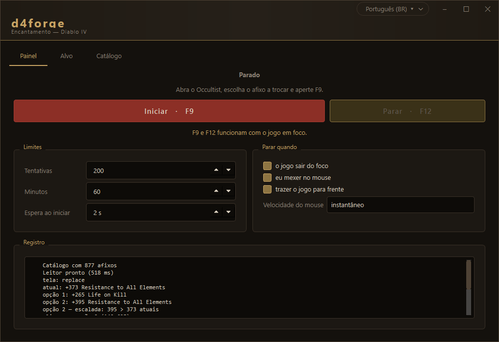

# d4forge

**Português** · [English](README.en.md)

Assistente de encantamento para Diablo IV. Automatiza o ciclo do Occultist:
aperta Enchant, aceita, **lê as duas opções na tela**, decide pelas suas regras
e repete até achar o afixo que você quer.

### Demo
Confira uma demonstração rápida do fluxo em [Demo.mp4](Demo.mp4).

<p align="center">
  
</p>

---

## Instalação

Baixe o `.zip` da [última release](../../releases/latest), extraia e execute
`d4forge.exe`. Não precisa de Python.

<details>
<summary>Rodando a partir do código</summary>

Precisa de **Python 3.13** — o 3.14 ainda não tem wheel de `onnxruntime` nem de
`PySide6`.

```powershell
py -3.13 -m venv .venv
.venv\Scripts\python.exe -m pip install -r requirements.txt
.venv\Scripts\python.exe run.py
```

Para gerar o executável e o atalho:

```powershell
.venv\Scripts\python.exe tools\build_exe.py
.venv\Scripts\python.exe tools\criar_atalho.py
```

</details>

### O antivírus vai reclamar

Ele reclama, e é falso positivo. No
[VirusTotal](https://www.virustotal.com/gui/file/dff736ae7f4e783990bf781401047c2764a1dc64fe967ffe9c5cf470fa45328f),
4 de 71 motores acusam o executável — e **os quatro são heurística ou machine
learning**, nenhum é assinatura:

| motor | detecção | leitura |
|---|---|---|
| Microsoft | `Trojan:Win32/Wacatac.B!ml` | o sufixo **`!ml`** é "machine learning"; é o balde genérico da Microsoft |
| SentinelOne | `Static AI - Suspicious PE` | diz "AI estático" no próprio nome |
| Arctic Wolf | `Unsafe` | genérico, sem família nomeada |
| SecureAge | `Malicious` | genérico, sem família nomeada |

Os outros 67 motores — Kaspersky, BitDefender, ESET, Avast, Sophos e companhia —
não acusam nada. Malware de verdade não passa batido por todos eles.

**Por que dispara.** Três coisas somadas:

1. O binário **não é assinado**. Certificado de assinatura custa por ano, e este
   projeto é gratuito.
2. O PyInstaller anexa o Python inteiro como *overlay* no fim do arquivo — o
   mesmo formato que um packer usa. É a tag `overlay` que o VirusTotal mostra.
3. O app faz, honestamente, **as mesmas coisas que um trojan faz**: injeta input
   sintético, captura a tela, enumera janelas de outro processo e eleva a própria
   prioridade. Descrever um bot de automação e descrever um RAT dá quase a mesma
   lista.

O terceiro item não tem solução: é o programa funcionando. Um assistente de
encantamento que não clicasse nem lesse a tela não serviria para nada.

**O que você pode fazer**, em ordem de confiança:

- **Rodar a partir do código-fonte** (logo abaixo). Aí não há binário nenhum para
  o antivírus julgar, e você lê exatamente o que vai executar.
- **Conferir o hash** do que baixou contra o publicado na release.
- **Ler o código.** Ele é todo público e a licença é GPL-3.0.

Se você quiser ajudar a resolver na fonte, [docs/falso-positivo.md](docs/falso-positivo.md)
tem os formulários dos quatro fornecedores e o texto pronto para enviar.

## Uso

1. **Alvo** — escolha o afixo, a condição e o valor. A busca é por trecho:
   digitar `resist` acha `Fire Resistance` e `Resistance to All Elements`.
2. Abra o Occultist no jogo e **selecione o afixo que quer trocar**.
3. Aperte **F9**.

**F9** inicia e para; **F12** só para. Ambos funcionam com o jogo em foco.

Ao iniciar, o app **traz o Diablo IV para frente sozinho** e confirma que
conseguiu — aí o ciclo começa em 0,4 s. A espera configurável só é cumprida
quando o Windows recusa o foco, que é justamente quando você precisa do Alt+Tab.

O ciclo também para se o jogo sair do foco, se você mexer no mouse, ou ao bater
os limites de tentativas e tempo.

### Subir aos poucos

Ligada por padrão. Enquanto a peça não tem o afixo-alvo, o bot aceita **qualquer
valor** dele; depois só troca por valor **estritamente maior**, até a meta:

```
x22% Shadow Damage Multiplier   (peça atual)
20% Poison Damage Multiplier    → pega
21% Poison Damage Multiplier    → pega  (21 > 20)
20% Poison Damage Multiplier    → não   (não desce)
25% Poison Damage Multiplier    → pega e encerra  (meta >= 24)
```

Cada tentativa custa o mesmo escolhendo ou não, então segurar o afixo certo cedo
nunca sai mais caro.

> Use **`>=`**, não `=`. Com `=`, um roll de 405 numa meta de 400 faz a escalada
> passar do alvo e nunca fechar.

---

## Como funciona

```
Enchant → [Accept] → [lê as 2 opções] → Replace Affix → Close → repete
```

`Accept` está entre colchetes porque **o diálogo de confirmação nem sempre
aparece**. Por isso o engine não segue uma sequência fixa: a cada volta ele olha
em que tela o jogo *está* e escolhe a ação.

`No Change` já vem marcado por padrão na tela Replace Affix. É isso que torna
"não escolher nada" a ação segura — e é o que o app faz sempre que não tem
certeza.

| módulo | papel |
|---|---|
| `window.py` | acha a janela do jogo |
| `capture.py` | captura via dxcam, com fallback para mss |
| `profile.py` | ROIs medidas em 1920x1080, escaladas para a resolução real |
| `vision/states.py` | identifica em qual das 5 telas o jogo está |
| `vision/ocr.py` | lê as linhas de texto |
| `affixes.py` | catálogo, gramática da linha e correção de leitura |
| `rules.py` | seu critério de aceite e a decisão final |
| `automation/` | SendInput e as travas de segurança |
| `engine.py` | o despachante |

### Números medidos

| etapa | custo |
|---|---|
| captura de uma ROI | ~0,1 ms |
| detectar o estado da tela | ~2 ms |
| OCR de uma linha (cache / novo) | ~1 ms / ~70 ms |
| reação do próprio jogo a um clique | ~80 ms |
| **uma volta completa** | **~1,5 s** |

---

## O que a construção ensinou

Quase tudo aqui saiu de medir contra capturas reais do jogo, não de intuição.

### O detector estava inflando a imagem 7×

A maior otimização do projeto, e nada tinha a ver com o nosso código. O RapidOCR
vem com `limit_type: min` e `limit_side_len: 736`: redimensiona até o **menor**
lado chegar a 736. Uma linha de afixo é larga e baixa (660×104), então isso
multiplicava tudo por 7 e mandava **4670×736 — 3,4 megapixels — para ler uma
linha de texto**.

| configuração | ms/linha | acerto |
|---|---|---|
| `min 736` (padrão do RapidOCR) | **1951** | 4/5 |
| `max 1280` (o que usamos) | **70** | 5/5 |

28× mais rápido e mais preciso — a imagem inflada também atrapalhava o modelo.

### Cinco erros silenciosos de leitura

Leituras erradas que se apresentavam como **confiáveis**, porque o nome do afixo
ainda casava com o catálogo. Todos vieram de sessões reais:

| OCR leu | ingenuamente daria | de verdade era |
|---|---|---|
| `+3,0D0 Shadow Resistance` | 3,0 | 3000 |
| `1 0.0% Impairment Reduction` | 1 | 10,0 |
| `+3. 000 ire Resistance` | 3,0 | 3000 |
| `+2 Life Kil` | 2 | 271 |
| `.7% Dodge Chance` | 0,7 | 7,7 |

Quatro guardas independentes, cada uma nascida de um caso acima:

1. **Gramática + catálogo** — o nome tem de existir e o valor sair limpo.
2. **Separador por contagem de dígitos** — 3 dígitos depois = milhar (`3,000`);
   1 ou 2 = decimal (`14.5%`). Não importa se o OCR leu vírgula ou ponto.
3. **Cobertura** — as caixas do detector têm de cobrir 95% da tinta. Pega
   caractere descartado, inclusive no meio da frase.
4. **Densidade** — largura de tinta por caractere. Medido em 56 recortes:
   leitura íntegra fica entre 8,1 e 10,5 px/char; truncada salta para 11,7–14,3.
   É a única que pega omissão do *reconhecedor*, quando o detector cobriu tudo.

O que não passa é marcado como duvidoso, e dúvida vira No Change.

### O cursor do jogo entra na captura

O Diablo IV desenha o próprio cursor **dentro do quadro renderizado** — não é o
cursor do Windows e não dá para excluí-lo. Parado sobre a lista de afixos, ele
acendia a região e a tela travada era confundida com a lista de seleção. Por isso
o app **estaciona o cursor** num ponto morto do painel depois de clicar — mas só
quando o clique cai sobre algo que lemos.

### Nada é julgado num quadro só

A interface do jogo é animada, e três bugs distintos vieram de decidir com uma
amostra única: a tela travada virando lista de seleção, a trava de mouse
disparando sozinha, e uma troca correta sendo abortada porque o orbe ainda estava
acendendo.

### Outras decisões contra medição

- **Binarizar é melhor que tom de cinza.** O painel tem brilho ~4 e o texto
  150–217. Um limiar em 120 isola o texto e apaga a marca d'água do PTR.
- **A imagem precisa de margem branca**, e nem grande demais: sem ela o detector
  corta as pontas; com 40 px ele parte a linha em várias caixas.
- **Ler a linha inteira, não em pedaços.** Separar "valor" e "nome" para cachear
  cada metade ficou mais rápido e bem pior.
- **Atlas de glifos não funciona nesta fonte** — as serifas se encostam e
  `Imbue` sai como um bloco único de 76 px. Ideia descartada.
- **Ordenar as caixas do detector é obrigatório** — ele devolve em ordem
  arbitrária, e juntar na ordem de chegada fazia `+4 Energy` virar `Energy +4`.

### Tirar a barra de título custa mais do que parece

A janela não tem a moldura do Windows, para não destoar do jogo ao lado. A
primeira versão devolvia à mão o que a moldura dava: arrastar e redimensionar,
respondendo a `mouseMoveEvent`. O resultado era uma janela que **movia**, e nada
mais — não encaixava ao chegar na borda, não obedecia Win+Seta, não mostrava o
cursor de redimensionar, não abria o Snap Layouts, não tinha sombra.

O jeito certo é o contrário do que parece: em vez de tirar a moldura, **mantê-la
e apagar só o desenho dela**. A janela conserva `WS_THICKFRAME | WS_CAPTION` — é
deles que vêm todos os gestos — e devolve zero em `WM_NCCALCSIZE`, que manda a
área do cliente ocupar a janela inteira. Daí em diante basta responder
`WM_NCHITTEST`: `HTCAPTION` na faixa do cabeçalho, `HT*` nas bordas,
`HTMAXBUTTON` sobre o botão de maximizar (é dele que sai o Snap Layouts).
Chrome, VS Code e o Terminal do Windows fazem assim. Fica em `gui/win32frame.py`.

Duas armadilhas no caminho:

- **Maximizada, o Windows estica a janela para fora da tela** pela espessura da
  moldura — que seria invisível, se houvesse moldura. Sem descontar isso no
  `WM_NCCALCSIZE`, a interface vaza pelas quatro bordas do monitor e ainda invade
  o vizinho. E se a barra de tarefas se esconde sozinha, é preciso deixar um
  pixel livre do lado dela, ou ela não reaparece.
- **`maximized` já é uma propriedade do QWidget, e só de leitura.**
  `setProperty("maximized", True)` não cria propriedade dinâmica nenhuma: falha
  calada, e a regra `[maximized="true"]` da folha de estilo nunca casa. Vale
  para `minimized` e `fullScreen` também.

### Um layout que não encolhe não é responsivo, é rígido

A janela exigia 880 px de largura e abria com 840 de altura — mais que a área
útil de um monitor 1080p, então ela nascia com parte de si fora do alcance. Um
mínimo menor do que o layout precisa não faz o layout encolher; só deixa os
widgets se sobreporem.

Foram três remédios, em `gui/responsive.py`:

- **Cada aba rola.** O mínimo de uma área de rolagem é o dela mesma, não o da
  página lá dentro — é isto que baixou o mínimo da janela de 880 para 520.
- **Cartões lado a lado viram coluna** abaixo da largura em que os dois cabem
  inteiros, com histerese para o layout não piscar durante o arrasto. A sutileza
  é a linha anunciar como mínimo a largura da COLUNA mesmo estando em linha:
  anunciando a da linha, ela reservava essa largura para sempre e a virada que
  existe para evitar a barra horizontal nunca acontecia.
- **Esticar sem limite é tão ruim quanto não esticar.** Maximizada num monitor
  de 1920, a janela dava 1230 px ao botão "Iniciar" e 750 a uma caixa de três
  dígitos.

E o que mais fixa largura mínima é **texto que não quebra linha**: um `QCheckBox`
nunca quebra, por mais que se peça. A explicação de "Subir aos poucos" saiu de
dentro da caixa de marcar e virou uma linha à parte por causa disso. Há um teste
que varre as abas atrás de rótulos longos sem quebra.

---

## AutoSkill

Substitui a macro do LGHUB. **Não tem botão de ligar**: o laço sobe junto com o
app e as hotkeys que você configurar são o liga/desliga, uma por recurso. Só
age com o Diablo IV em primeiro plano.

| recurso | o que faz |
|---|---|
| **AutoCast** | por slot: recastar ao sair do cooldown, spam, ou não encostar |
| **AutoPotion** | bebe abaixo de X% de vida, respeitando o cooldown da poção |
| **Esquiva / Portal** | apertam a bind no intervalo, sem ler nada da tela |

Cada bind é capturada por clique-e-aperte e aceita **tecla, botão do mouse
(inclusive os laterais) ou roda**. Cada hotkey de controle funciona em
**toggle** (um toque liga, outro desliga) ou **segurar**.

### Como ele sabe que a habilidade saiu do cooldown

Pelo **brilho**, não pela cor — são mais de cem habilidades no jogo e cada uma
tem a sua paleta. Medido nos prints de referência, seis slots cada:

| | disponível | em cooldown |
|---|---|---|
| brilho do decil mais claro | 226 – 234 | 89 – 94 |

São 130 pontos de margem, sem uma sobreposição. Não precisa de OCR: ler o
número da contagem custaria 20-30 ms **por slot** num laço que roda 40 vezes por
segundo, e é redundante — o escurecimento sozinho já separa os dois estados.

E o limiar não é fixo, porque existe ícone naturalmente escuro: o leitor guarda
o maior brilho já visto **naquele slot** e só aprende com quadros sem cooldown.
Converge no primeiro segundo de jogo e não pede calibração.

### Como ele lê a vida

Pela **borda** entre o cheio e o vazio, e o critério é "**o vazio é preto**" —
não "o cheio é vermelho". Parece a mesma coisa invertida e não é: o que enche o
orbe muda de cor (vermelho normal, rosa dessaturado sob escudo, azul quando a
barreira cobre tudo), enquanto o vazio é sempre o mesmo preto.

A diferença foi medida: **com vida cheia e barreira ativa**, o critério por
vermelho lia 89% — um limiar em 90% mandaria beber poção com a vida intacta. O
critério por escuro lê 99%.

Barreira cobrindo o orbe inteiro é lida como vida cheia. Não é defeito do
método: com o escudo por cima, a vida embaixo não está visível para ninguém.

---

## Catálogo de afixos

**Não existe API oficial da Blizzard para dados do Diablo IV.** O Battle.net Game
Data API cobre WoW, Diablo III, Hearthstone e StarCraft II; o D4 ficou de fora.

O app já vem com **~877 afixos** da lista enUS do
[d4lf](https://github.com/d4lfteam/d4lf), um loot filter que também lê a tela do
D4 por OCR — os nomes vêm na grafia exata da interface. Funciona offline.

As **faixas de roll** e o mapa **afixo → peça** são manuais. O
[d4data](https://github.com/DiabloTools/d4data) datminerado até os tem, mas as
faixas vivem dentro de fórmulas em arquivos nomeados por ID interno, sem junção
viável com o nome de exibição. Os números estão em
[d4builds.gg](https://d4builds.gg/database/gear-affixes/).

---

## Diagnóstico

Quando algo dá errado, o app grava em `captures/`:

- `ocr_NNN_opcaoN_ok.png` / `_duvidoso.png` — todo recorte que foi para o OCR
- `debug_*.png` — o quadro inteiro quando algo inesperado acontece

A pasta é esvaziada ao iniciar uma sessão e ao fechar a janela normalmente.
**Num crash a limpeza não roda** — que é exatamente quando a evidência importa.

## Limitações

- Medido em **1920×1080**. As regiões escalam por altura e são verificadas em
  1920×1080, 2560×1440 e 3840×2160. Em **ultrawide** (21:9) a posição horizontal
  do painel vem de modelo, não de medição — ninguém testou ainda, e o app avisa
  no registro quando detecta uma tela fora de 16:9.
- Cliente em **inglês**.
- Exige o jogo em primeiro plano — a captura lê o monitor, não a janela.
- As referências vieram de um **PTR**; uma build de produção pode diferir.

## Aviso

Este projeto não tem vínculo com a Blizzard Entertainment, não é endossado por
ela e não distribui nenhum material do jogo.

## Licença

[GPL-3.0](LICENSE). Quem distribuir uma versão modificada precisa abrir o código
também.

A lista de afixos vem do [d4lf](https://github.com/d4lfteam/d4lf) (MIT) e os
modelos de OCR do [RapidOCR](https://github.com/RapidAI/RapidOCR) (Apache-2.0).
Créditos completos em [NOTICE.md](NOTICE.md).

## Contribuindo

As telas de referência dos testes estão em `tests/fixtures/telas/` — são versões
higienizadas de capturas reais, com só as regiões que o app lê. Para regerá-las a
partir das suas próprias capturas, use `tools/sanitize_shots.py`.

```powershell
.venv\Scripts\python.exe -m pytest tests -q
```
